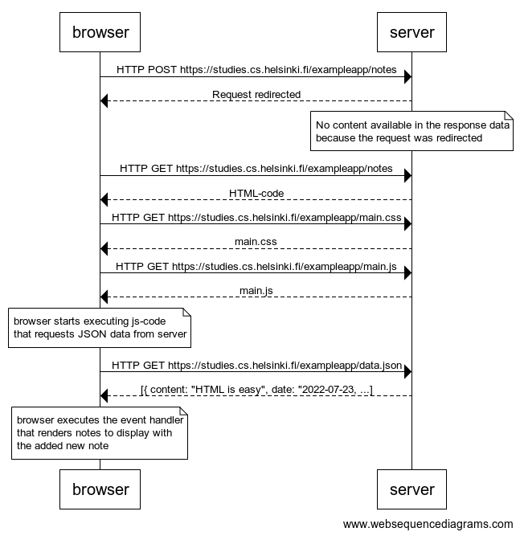

browser->server: HTTP POST https://studies.cs.helsinki.fi/exampleapp/notes
server-->browser: Request redirected
note over server:
No content available in the response data
because the request was redirected
end note
browser->server: HTTP GET https://studies.cs.helsinki.fi/exampleapp/notes
server-->browser: HTML-code
browser->server: HTTP GET https://studies.cs.helsinki.fi/exampleapp/main.css
server-->browser: main.css
browser->server: HTTP GET https://studies.cs.helsinki.fi/exampleapp/main.js
server-->browser: main.js

note over browser:
browser starts executing js-code
that requests JSON data from server
end note

browser->server: HTTP GET https://studies.cs.helsinki.fi/exampleapp/data.json
server-->browser: [{ content: "HTML is easy", date: "2022-07-23, ...]

note over browser:
browser executes the event handler
that renders notes to display with
the added new note
end note

The diagram image show up below

