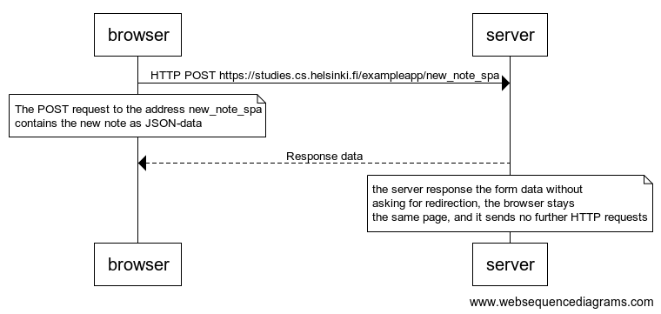

browser->server: HTTP POST https://studies.cs.helsinki.fi/exampleapp/new_note_spa
note over browser:
The POST request to the address new_note_spa
contains the new note as JSON-data
end note

server-->browser: Response data

note over server:
the server response the form data without
asking for redirection, the browser stays
the same page, and it sends no further HTTP requests
end note

The diagram image show up below

